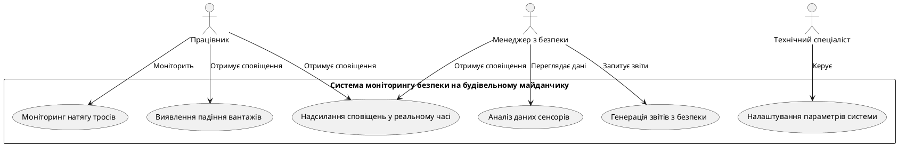

## Діаграма варіантів використання

```plantuml
@startuml

actor "Працівник" as Worker
actor "Менеджер з безпеки" as SafetyManager
actor "Технічний спеціаліст" as SysAdmin

rectangle "Система моніторингу безпеки на будівельному майданчику" {
    usecase "Моніторинг натягу тросів" as UC1
    usecase "Виявлення падіння вантажів" as UC2
    usecase "Надсилання сповіщень у реальному часі" as UC3
    usecase "Аналіз даних сенсорів" as UC4
    usecase "Налаштування параметрів системи" as UC5
    usecase "Генерація звітів з безпеки" as UC6
}

Worker --> UC1 : "Моніторить"
Worker --> UC2 : "Отримує сповіщення"
Worker --> UC3 : "Отримує сповіщення"

SafetyManager --> UC3 : "Отримує сповіщення"
SafetyManager --> UC6 : "Запитує звіти"
SafetyManager --> UC4 : "Переглядає дані"

SysAdmin --> UC5 : "Керує"

@enduml

```
