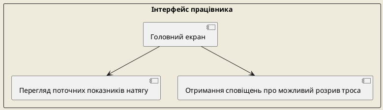
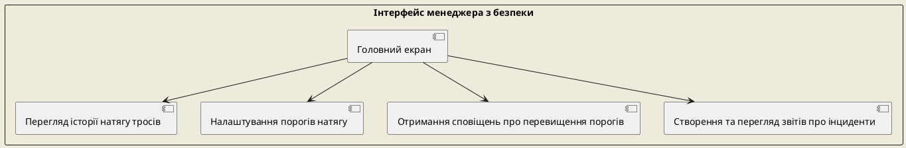
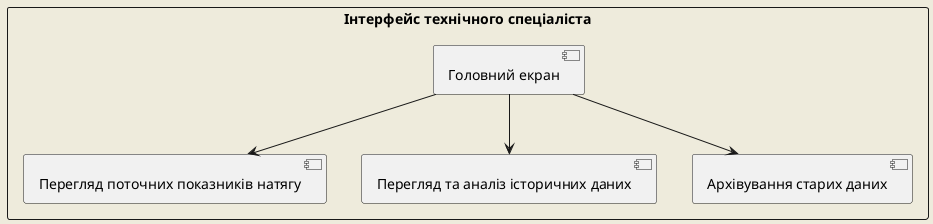

## Прототип інтерфейсу
### Для працівника

```plantuml
@startuml
skinparam backgroundColor #EEEBDC

rectangle "Інтерфейс працівника" {
    [Головний екран] --> [Перегляд поточних показників натягу]
    [Головний екран] --> [Отримання сповіщень про можливий розрив троса]
}

@enduml

```
### Для менеджера з безпеки

```plantuml
@startuml
skinparam backgroundColor #EEEBDC

rectangle "Інтерфейс менеджера з безпеки" {
    [Головний екран] --> [Перегляд історії натягу тросів]
    [Головний екран] --> [Налаштування порогів натягу]
    [Головний екран] --> [Отримання сповіщень про перевищення порогів]
    [Головний екран] --> [Створення та перегляд звітів про інциденти]
}

@enduml

```
### Для технічного спеціаліста

```plantuml
@startuml
skinparam backgroundColor #EEEBDC

rectangle "Інтерфейс технічного спеціаліста" {
    [Головний екран] --> [Перегляд поточних показників натягу]
    [Головний екран] --> [Перегляд та аналіз історичних даних]
    [Головний екран] --> [Архівування старих даних]
}

@enduml

```
